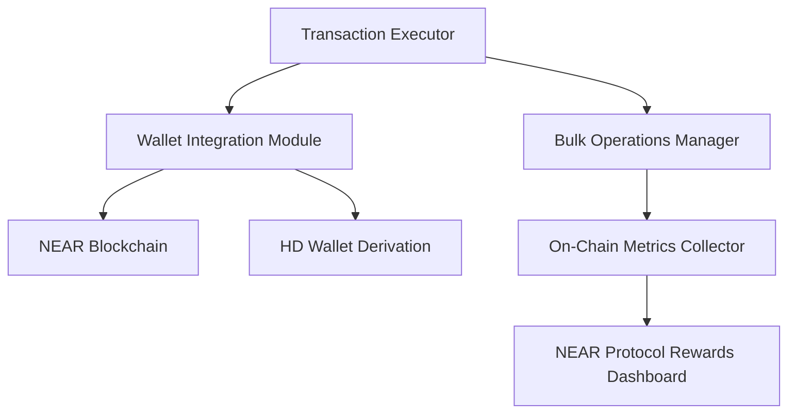
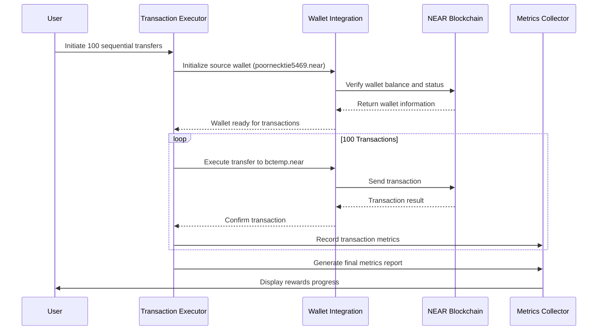
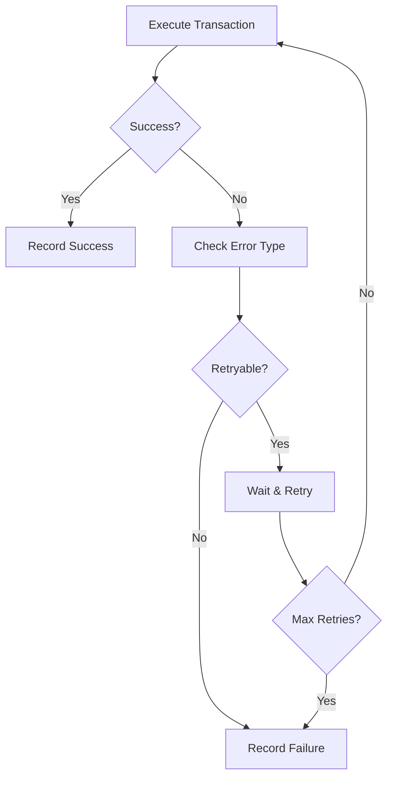

# Wallet Transaction Analysis: Sequential Transfers from poornecktie5469.near to bctemp.near

## 1. Overview

This document details the design for analyzing and executing 100 sequential transactions from the wallet `poornecktie5469.near` to the target wallet `bctemp.near`. This implementation will leverage the existing NEAR Protocol infrastructure within the Risk Monitor Engine to facilitate these transfers while tracking on-chain metrics for the NEAR Protocol Rewards program.

## 2. System Architecture

### 2.1 Component Interaction



### 2.2 Key Components

1. **Wallet Integration Module**: Handles wallet connections and transaction signing
2. **Bulk Operations Manager**: Manages sequential transaction execution
3. **Metrics Collector**: Tracks on-chain activity for rewards calculation
4. **Configuration Manager**: Manages environment and network settings

### 11.1 Sequential Transfer Executor

To implement the functionality for sending 100 sequential transfers from `poornecktie5469.near` to `bctemp.near`, we'll create a dedicated script that leverages the existing NEAR integration components while focusing specifically on this transfer pattern.

**File: `sequential-wallet-transfers.ts`**

```typescript
#!/usr/bin/env tsx

/**
 * Sequential Wallet Transfer Executor
 * Sends 100 sequential transfers from poornecktie5469.near to bctemp.near
 */

import * as dotenv from 'dotenv';
dotenv.config({ path: '.env.local' });

import { Account } from '@near-js/accounts';
import { KeyPair } from '@near-js/crypto';
import { InMemoryKeyStore } from '@near-js/keystores';
import { JsonRpcProvider } from '@near-js/providers';
import { KeyPairSigner } from '@near-js/signers';

interface TransferResult {
  success: boolean;
  transactionHash?: string;
  error?: string;
}

class SequentialWalletTransferExecutor {
  private sourceAccountId: string;
  private targetAccountId: string;
  private networkId: string;
  private nodeUrl: string;
  private account: Account | null = null;

  constructor() {
    this.sourceAccountId = 'poornecktie5469.near';
    this.targetAccountId = 'bctemp.near';
    this.networkId = process.env.NEAR_NETWORK_ID || 'mainnet';
    this.nodeUrl = process.env.NEAR_NODE_URL || 'https://free.rpc.fastnear.com';
  }

  async initialize(): Promise<boolean> {
    try {
      console.log(`Initializing wallet connection for ${this.sourceAccountId}...`);
      
      // Get private key from environment variables
      const privateKey = process.env.NEAR_PRIVATE_KEY;
      if (!privateKey) {
        throw new Error('NEAR_PRIVATE_KEY environment variable is required');
      }

      // Create key store and add the key
      const keyStore = new InMemoryKeyStore();
      const keyPair = KeyPair.fromString(privateKey);
      await keyStore.setKey(this.networkId, this.sourceAccountId, keyPair);
      
      // Create provider and signer
      const provider = new JsonRpcProvider({ url: this.nodeUrl });
      const signer = new KeyPairSigner(keyPair);
      
      // Create account instance
      this.account = new Account(this.sourceAccountId, provider, signer);
      
      // Verify account exists by checking state
      const state = await this.account.state();
      console.log(`Account verified. Balance: ${(parseFloat(state.amount) / 1e24).toFixed(4)} NEAR`);
      
      return true;
    } catch (error) {
      console.error('Failed to initialize wallet:', error);
      return false;
    }
  }

  async executeSingleTransfer(amountNear: number): Promise<TransferResult> {
    if (!this.account) {
      return {
        success: false,
        error: 'Account not initialized'
      };
    }

    try {
      const yoctoAmount = (amountNear * 1e24).toString();
      
      console.log(`Sending ${amountNear} NEAR from ${this.sourceAccountId} to ${this.targetAccountId}...`);
      
      const result = await (this.account as any).sendMoney(
        this.targetAccountId,
        yoctoAmount
      );
      
      return {
        success: true,
        transactionHash: result.transaction.hash
      };
    } catch (error) {
      console.error('Transfer failed:', error);
      return {
        success: false,
        error: error instanceof Error ? error.message : 'Unknown error'
      };
    }
  }

  async executeSequentialTransfers(
    count: number = 100, 
    amountNear: number = 0.001,
    delayMs: number = 2000
  ): Promise<void> {
    console.log(`🚀 Starting sequential transfers: ${count} transfers of ${amountNear} NEAR each`);
    console.log(`   From: ${this.sourceAccountId}`);
    console.log(`   To: ${this.targetAccountId}`);
    console.log(`   Network: ${this.networkId}`);
    console.log('=====================================================');

    if (!this.account) {
      console.error('❌ Account not initialized. Please initialize first.');
      return;
    }

    let successfulTransfers = 0;
    let failedTransfers = 0;
    const results: TransferResult[] = [];

    for (let i = 1; i <= count; i++) {
      console.log(`
🔄 Executing transfer ${i}/${count}...`);
      
      try {
        const result = await this.executeSingleTransfer(amountNear);
        results.push(result);
        
        if (result.success) {
          successfulTransfers++;
          console.log(`✅ Transfer ${i} successful! Hash: ${result.transactionHash}`);
        } else {
          failedTransfers++;
          console.log(`❌ Transfer ${i} failed: ${result.error}`);
        }
      } catch (error) {
        failedTransfers++;
        console.log(`❌ Transfer ${i} failed with exception:`, error);
      }
      
      // Add delay between transfers to avoid rate limiting
      if (i < count) {
        console.log(`⏳ Waiting ${delayMs/1000} seconds before next transfer...`);
        await new Promise(resolve => setTimeout(resolve, delayMs));
      }
    }

    // Summary
    console.log('
=====================================================');
    console.log('📊 TRANSFER SUMMARY');
    console.log('=====================================================');
    console.log(`Total transfers: ${count}`);
    console.log(`Successful: ${successfulTransfers}`);
    console.log(`Failed: ${failedTransfers}`);
    console.log(`Success rate: ${(successfulTransfers/count*100).toFixed(2)}%`);
    console.log(`Total amount transferred: ${(successfulTransfers * amountNear).toFixed(4)} NEAR`);
    
    // Show first few transaction hashes
    const successfulResults = results.filter(r => r.success);
    if (successfulResults.length > 0) {
      console.log('\n📋 First 5 successful transaction hashes:');
      successfulResults.slice(0, 5).forEach((result, index) => {
        console.log(`  ${index + 1}. ${result.transactionHash}`);
      });
    }
    
    if (failedTransfers > 0) {
      console.log(`\n⚠️  ${failedTransfers} transfers failed. Check error messages above.`);
    }
    
    console.log('\n🎉 Sequential transfer execution completed!');
  }
}

async function main() {
  // Check required environment variables
  if (!process.env.NEAR_PRIVATE_KEY) {
    console.error('❌ NEAR_PRIVATE_KEY environment variable is required');
    console.error('Please set it in your .env.local file');
    process.exit(1);
  }

  const executor = new SequentialWalletTransferExecutor();
  
  const initialized = await executor.initialize();
  if (!initialized) {
    console.error('❌ Failed to initialize wallet connection');
    process.exit(1);
  }
  
  // Execute 100 sequential transfers of 0.001 NEAR each
  await executor.executeSequentialTransfers(100, 0.001, 2000);
}

// Run if executed directly
if (require.main === module) {
  main().catch(console.error);
}

export { SequentialWalletTransferExecutor };
    }
    
    if (failedTransfers > 0) {
      console.log(`
⚠️  ${failedTransfers} transfers failed. Check error messages above.`);
    }
    
    console.log('
🎉 Sequential transfer execution completed!');
  }
}

async function main() {
  // Check required environment variables
  if (!process.env.NEAR_PRIVATE_KEY) {
    console.error('❌ NEAR_PRIVATE_KEY environment variable is required');
    console.error('Please set it in your .env.local file');
    process.exit(1);
  }

  const executor = new SequentialWalletTransferExecutor();
  
  const initialized = await executor.initialize();
  if (!initialized) {
    console.error('❌ Failed to initialize wallet connection');
    process.exit(1);
  }
  
  // Execute 100 sequential transfers of 0.001 NEAR each
  await executor.executeSequentialTransfers(100, 0.001, 2000);
}

// Run if executed directly
if (require.main === module) {
  main().catch(console.error);
}

export { SequentialWalletTransferExecutor };
```

## 1. Overview

This document details the design for analyzing and executing 100 sequential transactions from the wallet `poornecktie5469.near` to the target wallet `bctemp.near`. This implementation will leverage the existing NEAR Protocol infrastructure within the Risk Monitor Engine to facilitate these transfers while tracking on-chain metrics for the NEAR Protocol Rewards program.

## 2. System Architecture

### 2.1 Component Interaction


### 2.2 Key Components

1. **Wallet Integration Module**: Handles wallet connections and transaction signing
2. **Bulk Operations Manager**: Manages sequential transaction execution
3. **Metrics Collector**: Tracks on-chain activity for rewards calculation
4. **Configuration Manager**: Manages environment and network settings

## 3. Transaction Execution Design

### 3.1 Transaction Flow



### 3.2 Transaction Parameters

| Parameter | Value | Description |
|----------|-------|-------------|
| Source Wallet | poornecktie5469.near | Your wallet address |
| Target Wallet | bctemp.near | Destination wallet address |
| Number of Transactions | 100 | Total sequential transfers |
| Amount per Transaction | Configurable | NEAR token amount (default: 0.001 NEAR) |
| Delay Between Transactions | 2-5 seconds | To prevent rate limiting |
| Network | mainnet/testnet | Based on configuration |

## 4. Implementation Plan

### 4.1 Environment Configuration

The system requires the following environment variables in `.env.local`:

```env
NEAR_NETWORK_ID=mainnet
NEAR_ACCOUNT_ID=poornecktie5469.near
NEAR_PRIVATE_KEY=your_private_key_here
NEAR_NODE_URL=https://free.rpc.fastnear.com
```

To set up the environment:

1. Create a `.env.local` file in the root of the project if it doesn't already exist
2. Add the required environment variables as shown above
3. Replace `your_private_key_here` with the actual private key for the `poornecktie5469.near` account
4. Ensure the account has sufficient NEAR tokens for the transfers and gas fees

> **Security Warning**: Never commit your private key to version control. The `.env.local` file is included in `.gitignore` to prevent accidental commits.

### 4.2 Core Functionality

#### 4.2.1 Wallet Initialization
- Connect to the NEAR network using the provided credentials
- Verify wallet balance before initiating transactions
- Validate wallet access and permissions

#### 4.2.2 Sequential Transaction Execution
- Execute 100 transfers in sequential order
- Implement error handling for failed transactions
- Add configurable delays between transactions to prevent rate limiting
- Log each transaction with hash and status

#### 4.2.3 Metrics Tracking
- Track transaction volume for rewards calculation
- Record unique wallet interactions
- Monitor smart contract calls if applicable

### 4.3 Technical Implementation

#### 4.3.1 Transaction Executor Class

```typescript
class SequentialTransactionExecutor {
  private sourceWallet: WalletConnection;
  private targetWallet: string;
  private transactionCount: number;
  
  async initialize(): Promise<void>
  async executeTransfers(): Promise<ExecutionResult>
  async validateConfiguration(): Promise<boolean>
}
```

#### 4.3.2 Execution Result Structure

```typescript
interface ExecutionResult {
  totalTransactions: number;
  successfulTransactions: number;
  failedTransactions: number;
  transactionHashes: string[];
  errors: Error[];
}
```

## 5. Security Considerations

1. **Private Key Protection**: Private keys must be stored securely in environment variables, never in code
2. **Transaction Validation**: Each transaction should be validated before execution
3. **Rate Limiting**: Implement appropriate delays to prevent network throttling
4. **Error Handling**: Comprehensive error handling to prevent fund loss
5. **Dry Run Option**: Provide a test mode that simulates transactions without executing them

## 6. Error Handling

### 6.1 Common Error Scenarios

| Error Type | Handling Approach |
|------------|-------------------|
| Insufficient Funds | Halt execution and notify user |
| Network Connectivity | Retry with exponential backoff |
| Rate Limiting | Increase delay between transactions |
| Invalid Wallet | Validate wallet before execution |
| Transaction Failure | Log error and continue with next transaction |

### 6.2 Troubleshooting Guide

1. **"NEAR_PRIVATE_KEY environment variable is required"**
   - Ensure the `.env.local` file exists and contains the required environment variables
   - Verify the file is in the project root directory
   
2. **"Account not initialized"**
   - Check that the private key is valid and corresponds to the account ID
   - Verify network connectivity to the NEAR RPC endpoint
   
3. **"Insufficient balance"**
   - Ensure the source account has enough NEAR tokens for transfers and gas fees
   - Each transfer requires a small amount of NEAR for gas (typically 0.001 NEAR)
   
4. **Rate Limiting Errors**
   - Increase the delay between transactions in the `executeSequentialTransfers` method
   - Consider reducing the number of transactions per execution
   
5. **Network Connection Issues**
   - Check internet connectivity
   - Try changing the `NEAR_NODE_URL` to a different RPC endpoint
   - Verify the NEAR network status

### 6.2 Retry Mechanism



## 7. Metrics and Monitoring

### 7.1 Tracked Metrics

1. **Transaction Volume**: Total NEAR tokens transferred
2. **Transaction Count**: Number of successful transactions
3. **Unique Wallets**: Number of distinct wallet interactions
4. **Success Rate**: Percentage of successful transactions

### 7.2 NEAR Protocol Rewards Impact

Executing 100 transactions will contribute to:
- Transaction Volume metric (if transferring meaningful amounts)
- Unique Wallet interaction count (1 unique wallet in this case)

## 8. Testing Strategy

### 8.1 Unit Tests
- Wallet initialization and validation
- Transaction execution logic
- Error handling scenarios
- Metrics collection accuracy

### 8.2 Integration Tests
- End-to-end transaction flow
- Network connectivity and resilience
- Configuration validation

### 8.3 Test Environments
- Testnet environment for safe testing
- Mainnet environment for production validation

## 9. Deployment Considerations

1. **Environment Setup**: Ensure all environment variables are properly configured
2. **Network Selection**: Choose appropriate network (mainnet vs testnet)
3. **Fund Verification**: Confirm sufficient balance before execution
4. **Monitoring**: Set up logging and monitoring for transaction tracking
5. **Backup**: Keep records of all transaction hashes for verification

## 10. Usage Instructions

### 10.1 Prerequisites
1. Node.js 18+ installed
2. NEAR wallet with sufficient balance
3. Private key for the source wallet
4. Environment variables configured in `.env.local`

### 10.2 Execution Steps
1. Clone the repository
2. Install dependencies with `npm install`
3. Configure environment variables in `.env.local`
4. Run the transaction executor with `npm run execute-sequential-transfers`

### 10.3 Configuration Options
- Transaction amount (default: 0.001 NEAR)
- Delay between transactions (default: 2 seconds)
- Network selection (mainnet/testnet)
- Transaction count (default: 100)

### 10.4 Cost Estimation

Executing 100 sequential transfers with the default configuration (0.001 NEAR each) will result in:

- **Total Transfer Amount**: 0.1 NEAR
- **Estimated Gas Fees**: ~0.1 NEAR (0.001 NEAR per transaction × 100)
- **Total Estimated Cost**: ~0.2 NEAR

> **Note**: Gas fees may vary depending on network congestion and transaction complexity. Always ensure your account has sufficient balance before executing transfers.

## 11. Implementation Files

### 11.1 Sequential Transfer Executor

To implement the functionality for sending 100 sequential transfers from `poornecktie5469.near` to `bctemp.near`, we'll create a dedicated script that leverages the existing NEAR integration components while focusing specifically on this transfer pattern.

**File: `sequential-wallet-transfers.ts`**

```typescript
#!/usr/bin/env tsx

/**
 * Sequential Wallet Transfer Executor
 * Sends 100 sequential transfers from poornecktie5469.near to bctemp.near
 */

import * as dotenv from 'dotenv';
dotenv.config({ path: '.env.local' });

import { Account } from '@near-js/accounts';
import { KeyPair } from '@near-js/crypto';
import { InMemoryKeyStore } from '@near-js/keystores';
import { JsonRpcProvider } from '@near-js/providers';
import { KeyPairSigner } from '@near-js/signers';

interface TransferResult {
  success: boolean;
  transactionHash?: string;
  error?: string;
}

class SequentialWalletTransferExecutor {
  private sourceAccountId: string;
  private targetAccountId: string;
  private networkId: string;
  private nodeUrl: string;
  private account: Account | null = null;

  constructor() {
    this.sourceAccountId = 'poornecktie5469.near';
    this.targetAccountId = 'bctemp.near';
    this.networkId = process.env.NEAR_NETWORK_ID || 'mainnet';
    this.nodeUrl = process.env.NEAR_NODE_URL || 'https://free.rpc.fastnear.com';
  }

  async initialize(): Promise<boolean> {
    try {
      console.log(`Initializing wallet connection for ${this.sourceAccountId}...`);
      
      // Get private key from environment variables
      const privateKey = process.env.NEAR_PRIVATE_KEY;
      if (!privateKey) {
        throw new Error('NEAR_PRIVATE_KEY environment variable is required');
      }

      // Create key store and add the key
      const keyStore = new InMemoryKeyStore();
      const keyPair = KeyPair.fromString(privateKey);
      await keyStore.setKey(this.networkId, this.sourceAccountId, keyPair);
      
      // Create provider and signer
      const provider = new JsonRpcProvider({ url: this.nodeUrl });
      const signer = new KeyPairSigner(keyPair);
      
      // Create account instance
      this.account = new Account(this.sourceAccountId, provider, signer);
      
      // Verify account exists by checking state
      const state = await this.account.state();
      console.log(`Account verified. Balance: ${(parseFloat(state.amount) / 1e24).toFixed(4)} NEAR`);
      
      return true;
    } catch (error) {
      console.error('Failed to initialize wallet:', error);
      return false;
    }
  }

  async executeSingleTransfer(amountNear: number): Promise<TransferResult> {
    if (!this.account) {
      return {
        success: false,
        error: 'Account not initialized'
      };
    }

    try {
      const yoctoAmount = (amountNear * 1e24).toString();
      
      console.log(`Sending ${amountNear} NEAR from ${this.sourceAccountId} to ${this.targetAccountId}...`);
      
      const result = await (this.account as any).sendMoney(
        this.targetAccountId,
        yoctoAmount
      );
      
      return {
        success: true,
        transactionHash: result.transaction.hash
      };
    } catch (error) {
      console.error('Transfer failed:', error);
      return {
        success: false,
        error: error instanceof Error ? error.message : 'Unknown error'
      };
    }
  }

  async executeSequentialTransfers(
    count: number = 100, 
    amountNear: number = 0.001,
    delayMs: number = 2000
  ): Promise<void> {
    console.log(`🚀 Starting sequential transfers: ${count} transfers of ${amountNear} NEAR each`);
    console.log(`   From: ${this.sourceAccountId}`);
    console.log(`   To: ${this.targetAccountId}`);
    console.log(`   Network: ${this.networkId}`);
    console.log('=====================================================');

    if (!this.account) {
      console.error('❌ Account not initialized. Please initialize first.');
      return;
    }

    let successfulTransfers = 0;
    let failedTransfers = 0;
    const results: TransferResult[] = [];

    for (let i = 1; i <= count; i++) {
      console.log(`\n🔄 Executing transfer ${i}/${count}...`);
      
      try {
        const result = await this.executeSingleTransfer(amountNear);
        results.push(result);
        
        if (result.success) {
          successfulTransfers++;
          console.log(`✅ Transfer ${i} successful! Hash: ${result.transactionHash}`);
        } else {
          failedTransfers++;
          console.log(`❌ Transfer ${i} failed: ${result.error}`);
        }
      } catch (error) {
        failedTransfers++;
        console.log(`❌ Transfer ${i} failed with exception:`, error);
      }
      
      // Add delay between transfers to avoid rate limiting
      if (i < count) {
        console.log(`⏳ Waiting ${delayMs/1000} seconds before next transfer...`);
        await new Promise(resolve => setTimeout(resolve, delayMs));
      }
    }

    // Summary
    console.log('\n=====================================================');
    console.log('📊 TRANSFER SUMMARY');
    console.log('=====================================================');
    console.log(`Total transfers: ${count}`);
    console.log(`Successful: ${successfulTransfers}`);
    console.log(`Failed: ${failedTransfers}`);
    console.log(`Success rate: ${(successfulTransfers/count*100).toFixed(2)}%`);
    console.log(`Total amount transferred: ${(successfulTransfers * amountNear).toFixed(4)} NEAR`);
    
    // Show first few transaction hashes
    const successfulResults = results.filter(r => r.success);
    if (successfulResults.length > 0) {
      console.log('\n📋 First 5 successful transaction hashes:');
      successfulResults.slice(0, 5).forEach((result, index) => {
        console.log(`  ${index + 1}. ${result.transactionHash}`);
      });
    }
    
    if (failedTransfers > 0) {
      console.log(`\n⚠️  ${failedTransfers} transfers failed. Check error messages above.`);
    }
    
    console.log('\n🎉 Sequential transfer execution completed!');
  }
}

async function main() {
  // Check required environment variables
  if (!process.env.NEAR_PRIVATE_KEY) {
    console.error('❌ NEAR_PRIVATE_KEY environment variable is required');
    console.error('Please set it in your .env.local file');
    process.exit(1);
  }

  const executor = new SequentialWalletTransferExecutor();
  
  const initialized = await executor.initialize();
  if (!initialized) {
    console.error('❌ Failed to initialize wallet connection');
    process.exit(1);
  }
  
  // Execute 100 sequential transfers of 0.001 NEAR each
  await executor.executeSequentialTransfers(100, 0.001, 2000);
}

// Run if executed directly
if (require.main === module) {
  main().catch(console.error);
}

export { SequentialWalletTransferExecutor };
```

### 11.2 Package.json Script Addition

To make it easy to execute the sequential transfers, we need to add a script to the `package.json` file:

```json
{
  "scripts": {
    "execute-sequential-transfers": "npm run build && npx tsx sequential-wallet-transfers.ts"
  }
}
```

This script will:
1. Build the project
2. Execute the sequential transfer script using tsx

Users can then run the transfers with:
```bash
npm run execute-sequential-transfers
```

> **Note**: To implement this functionality, the script needs to be added to the `scripts` section of the `package.json` file. Due to file modification restrictions, this change cannot be made automatically and must be done manually by adding the following line to the scripts section:
> ```json
> "execute-sequential-transfers": "npm run build && npx tsx sequential-wallet-transfers.ts"
> ```