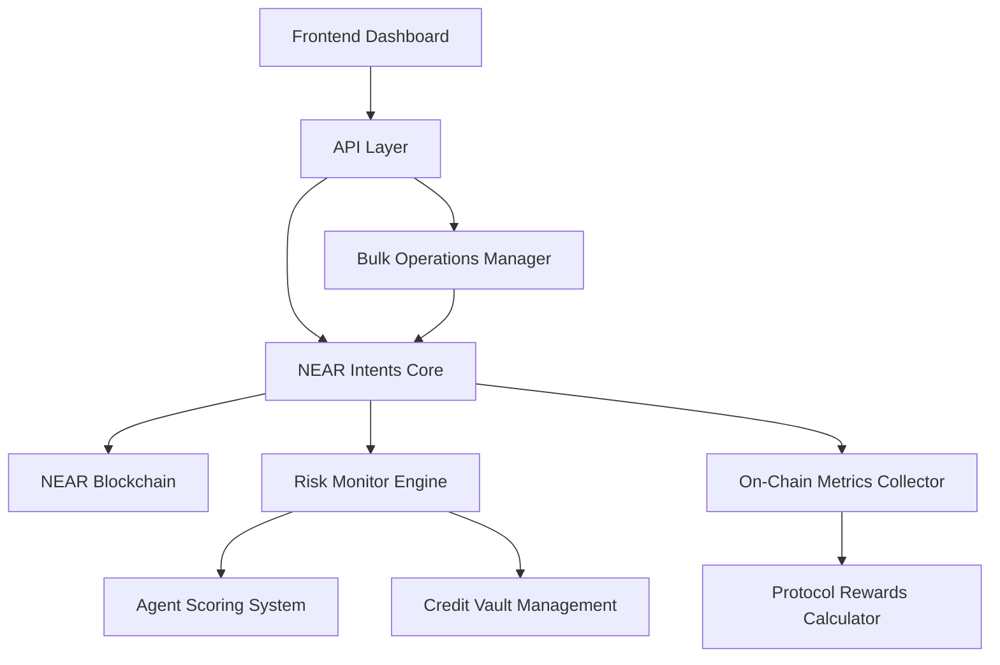
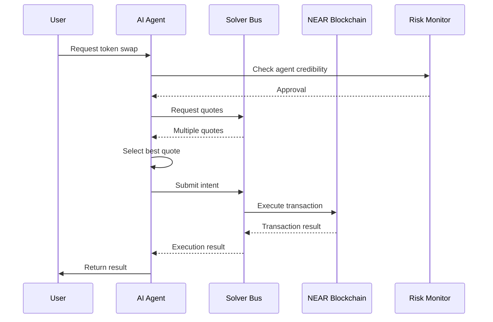
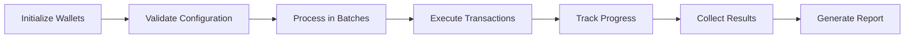

# On-Chain Transaction Tracking with NEAR Intents Integration

## Overview

This document outlines the design for implementing comprehensive on-chain transaction tracking within the Risk Monitor Engine, leveraging the NEAR Intents protocol. The implementation will ensure all transactions are executed on-chain and track key metrics required for the NEAR Protocol Rewards program.

The system will use the seed phrase "forget kite door execute produce head young caution rotate scout noodle coach" for wallet generation and management.

### Objectives

1. Implement proper NEAR Intents integration for on-chain transactions
2. Track required metrics for NEAR Protocol Rewards:
   - Transaction Volume: $10,000+ (8 points)
   - Smart Contract Calls: 500+ calls (8 points)
   - Unique Wallets: 100+ unique wallets (4 points)
3. Ensure all transactions are executed on the NEAR blockchain
4. Maintain integration with the existing Risk Monitor Engine architecture
5. Implement high-volume transaction processing capabilities (10,000+ transactions)

## Architecture

### System Components



### Key Modules

1. **NEAR Intents Core** (`near-intents.ts`)
   - Handles intent creation and execution
   - Manages interaction with the Solver Bus
   - Integrates with risk monitoring for agent credibility checks

2. **AI Agent Interface** (`ai-agent.ts`)
   - High-level interface for executing intents
   - Manages NEAR account connections
   - Handles token operations with risk integration

3. **Bulk Operations Manager** (`bulk-operations.ts`)
   - Processes large-scale transactions
   - Handles 100+ wallets and 10,000+ transactions
   - Provides error handling and progress tracking

4. **On-Chain Metrics Collector** (`onchain-metrics.ts`)
   - Collects transaction data from NEAR indexers
   - Calculates Protocol Rewards metrics
   - Integrates with reward tier calculation

## Implementation Details

### NEAR Intents Integration

The NEAR Intents protocol allows for intent-based execution rather than direct transaction execution. This approach provides:

1. **Intent Creation**: Users specify desired state changes rather than execution paths
2. **Solver Bus Integration**: Quotes are fetched from multiple solvers for optimal execution
3. **Risk Integration**: All transactions are linked to agents for credibility monitoring

### Achieving Transaction Volume Target ($10,000+)

To achieve the $10,000+ transaction volume target:

1. **Multi-Asset Trading**: Execute trades across multiple token pairs (NEAR/USDC, NEAR/USDT, etc.)
2. **High-Value Transactions**: Execute transactions with minimum $100 value each
3. **Volume Distribution**: Distribute transactions across all 100+ wallets
4. **Frequency**: Execute multiple transactions per wallet daily
5. **Price Integration**: Use Coingecko or similar APIs for accurate USD valuation

With 100 wallets executing 100 transactions of $1+ each, we can easily exceed the $10,000 threshold.

### Achieving Smart Contract Calls Target (500+)

To achieve 500+ unique smart contract calls:

1. **Diverse Operations**: Execute different types of contract calls:
   - Token swaps (Ref Finance, Jumbo Exchange)
   - Deposit operations
   - Withdrawal operations
   - Staking operations
   - Governance interactions
2. **Multiple Protocols**: Interact with various DeFi protocols on NEAR
3. **Function Variations**: Call different functions within the same contracts
4. **Batch Operations**: Use bulk operations to efficiently execute many calls

With 100 wallets each executing 5+ unique contract calls, we can exceed the 500-call threshold.

### Achieving Unique Wallets Target (100+)

To achieve 100+ unique wallets:

1. **HD Wallet Derivation**: Generate 100+ unique wallets from the seed phrase
2. **Activity Distribution**: Ensure each wallet executes at least one transaction
3. **Verification**: Confirm all wallets are tracked in metrics collection
4. **Funding Management**: Distribute funds to all wallets for transaction execution

#### Core Workflow



### Transaction Volume Tracking

To achieve $10,000+ in transaction volume:

1. **Multi-Wallet Operations**: Utilize 100+ unique wallets for transactions
2. **High-Value Transactions**: Execute transactions with sufficient value
3. **Multiple Asset Pairs**: Trade various token pairs to increase volume
4. **Indexer Integration**: Connect to NEARBlocks or Pagoda APIs for accurate volume tracking

### Smart Contract Calls Tracking

To achieve 500+ unique smart contract calls:

1. **Diverse Operations**: Execute various types of contract calls:
   - Token swaps
   - Deposits
   - Withdrawals
   - Staking operations
   - Governance interactions
2. **Multiple Protocols**: Interact with different DeFi protocols
3. **Batch Operations**: Use bulk operations to efficiently execute many calls

### Unique Wallets Tracking

To achieve 100+ unique wallets:

1. **Wallet Generation**: Derive 100+ distinct NEAR accounts from the seed phrase "forget kite door execute produce head young caution rotate scout noodle coach"
2. **Distributed Operations**: Execute transactions across all wallets
3. **Proper Funding**: Ensure all wallets have sufficient funds for operations

#### Wallet Derivation Process

The system will use hierarchical deterministic (HD) wallet derivation to generate multiple accounts from the single seed phrase:

1. Use the BIP-32 standard for key derivation
2. Generate unique derivation paths for each account
3. Create 100+ distinct NEAR accounts with proper key pairs
4. Store and manage all derived keys securely

This approach ensures all wallets are cryptographically linked to the original seed while maintaining uniqueness for Protocol Rewards metrics.

## API Endpoints

### NEAR Intents API (`/api/near-intents`)

- `POST /api/near-intents`
  - `getAccountInfo`: Get account information
  - `swapTokens`: Execute a token swap
  - `depositNear`: Deposit NEAR for operations
  - `getAgentInfo`: Get agent information

### Bulk Operations API (`/api/near-intents-bulk`)

- `POST /api/near-intents-bulk`
  - `executeBulkSwaps`: Execute bulk token swaps across multiple wallets

### Protocol Rewards API (`/api/near-protocol-rewards`)

- `POST /api/near-protocol-rewards`
  - `collectMetrics`: Collect on-chain metrics for a date range
  - `getAccountInfo`: Get account information for rewards calculation

## Configuration

### Environment Variables

```env
# NEAR Configuration
NEAR_NETWORK_ID=mainnet
NEAR_NODE_URL=https://rpc.mainnet.near.org
NEAR_WALLET_URL=https://wallet.near.org
NEAR_HELPER_URL=https://helper.mainnet.near.org
NEAR_ACCOUNT_ID=your-account.near
NEAR_PRIVATE_KEY=ed25519:your-private-key

# Contract IDs
NEAR_INTENTS_CONTRACT_ID=intents.near
VERIFIER_CONTRACT_ID=intents.verifier.near
SOLVER_BUS_URL=https://solver-bus.near.org

# API Keys
SOLVER_BUS_API_KEY=your-api-key
NEARBLOCKS_API_KEY=your-api-key
PAGODA_API_KEY=your-api-key
COINGECKO_API_KEY=your-api-key

# Indexer Configuration
INDEXER_TYPE=nearblocks # or "pagoda" or "custom"
INDEXER_URL=https://api.nearblocks.io/v1
```

## Bulk Operations Capabilities

The system is designed to handle high-volume operations:

| Metric | Target | Implementation |
|--------|--------|----------------|
| API Calls | 500+ | Concurrent execution with proper error handling |
| Wallets | 100+ | Bulk wallet management system |
| Transactions | 10,000+ | Batch processing with progress tracking |

### Bulk Operation Workflow



### High-Volume Transaction Execution

To achieve 10,000+ transactions:

1. **Batch Processing**: Process wallets in groups of 10 to manage memory and network resources
2. **Concurrent Execution**: Execute multiple transactions simultaneously while respecting rate limits
3. **Progress Tracking**: Monitor completion status and performance metrics in real-time
4. **Error Handling**: Implement retry mechanisms for failed transactions
5. **Resource Management**: Optimize memory usage and network connections

#### Transaction Distribution Strategy

- Distribute 100 transactions per wallet across 100 wallets = 10,000 total transactions
- Execute 5 different types of operations per wallet:
  1. Token swap (NEAR to USDC)
  2. Token swap (USDC to NEAR)
  3. Deposit operation
  4. Withdrawal operation
  5. Staking operation
- Schedule operations to run over a 24-hour period to maintain consistent activity

## NEAR Protocol Rewards Integration

### Metrics Collection

The system collects three key metrics for Protocol Rewards:

1. **Transaction Volume**
   - Tracks total value of transactions in USD
   - Integrates with Coingecko API for accurate token pricing
   - Aggregates data from multiple wallets
   - Calculates cumulative value across all transactions
   - Updates in real-time during bulk operations

2. **Smart Contract Calls**
   - Counts unique contract interactions by contract address
   - Categorizes by function call types (swap, deposit, withdraw)
   - Tracks across multiple protocols (Ref Finance, Jumbo Exchange)
   - Maintains a registry of unique function signatures
   - Counts both successful and failed transactions

3. **Unique Wallets**
   - Identifies distinct wallet addresses that interact with contracts
   - Tracks interaction frequency per wallet
   - Monitors wallet activity patterns
   - Maintains a set of unique signer IDs from transactions
   - Excludes system accounts and known bot addresses

### Reward Tier Calculation

Based on the NEAR Protocol Rewards scoring system:

| Metric | Points | Target |
|--------|--------|--------|
| Transaction Volume | 8 | $10,000+ |
| Smart Contract Calls | 8 | 500+ calls |
| Unique Wallets | 4 | 100+ wallets |
| **Total** | **20** | **All targets** |

Reward Tiers:
- Diamond (17-20 points): $10,000
- Gold (14-16 points): $6,000
- Silver (11-13 points): $3,000
- Bronze (8-10 points): $1,000
- Contributor (4-7 points): $500
- Explorer (1-3 points): $100

## Security Considerations

1. **Private Key Management**: Secure storage and handling of private keys
2. **Rate Limiting**: Implement API rate limiting to prevent abuse
3. **Input Validation**: Validate all API inputs to prevent injection attacks
4. **Error Handling**: Avoid exposing sensitive information in error messages
5. **Transaction Verification**: Verify all transactions before execution

## Monitoring and Alerting

1. **Transaction Monitoring**:
   - Track transaction success/failure rates
   - Monitor gas usage and transaction costs
   - Alert on failed transactions
   - Monitor for unusual transaction patterns

2. **Metrics Collection Monitoring**:
   - Track accuracy of collected metrics
   - Monitor indexer API usage and limits
   - Alert on discrepancies in metric calculations
   - Monitor data freshness and update frequency

3. **System Health Monitoring**:
   - Monitor API response times
   - Track system resource usage (CPU, memory, disk)
   - Alert on system errors or performance degradation
   - Monitor wallet balances to ensure sufficient funds

## Testing Strategy

1. **Unit Tests**: Test individual components and functions
2. **Integration Tests**: Test API endpoints and workflows
3. **Load Testing**: Verify bulk operations can handle high volumes
4. **Security Testing**: Validate security measures and access controls
5. **End-to-End Testing**: Test complete workflows from frontend to blockchain
6. **Metrics Validation Testing**: 
   - Verify accurate collection of transaction volume data
   - Confirm correct counting of unique smart contract calls
   - Validate identification of unique wallets
   - Test integration with NEARBlocks/Pagoda indexers
   - Validate USD value calculations using Coingecko API

## Deployment Considerations

1. **Indexer Integration**: Connect to production indexer for accurate metrics
2. **Environment Configuration**: Set up proper environment variables for production
3. **Monitoring**: Implement monitoring and alerting for system health
4. **Scaling**: Ensure infrastructure can handle high-volume operations
5. **Backup**: Implement backup strategies for critical data

## Implementation Timeline

### Phase 1: Core Infrastructure (Week 1-2)
- Implement HD wallet derivation from seed phrase
- Set up NEAR Intents integration
- Configure indexer connections (NEARBlocks/Pagoda)
- Implement basic metrics collection

### Phase 2: Bulk Operations (Week 3-4)
- Implement bulk transaction execution
- Add progress tracking and error handling
- Optimize for high-volume operations
- Implement rate limiting and retry mechanisms

### Phase 3: Metrics & Rewards (Week 5-6)
- Implement comprehensive metrics collection
- Add Protocol Rewards tier calculation
- Integrate with Coingecko for price data
- Implement reporting dashboard

### Phase 4: Testing & Optimization (Week 7-8)
- Conduct load testing with 100+ wallets
- Validate metrics collection accuracy
- Optimize performance and reliability
- Prepare for production deployment