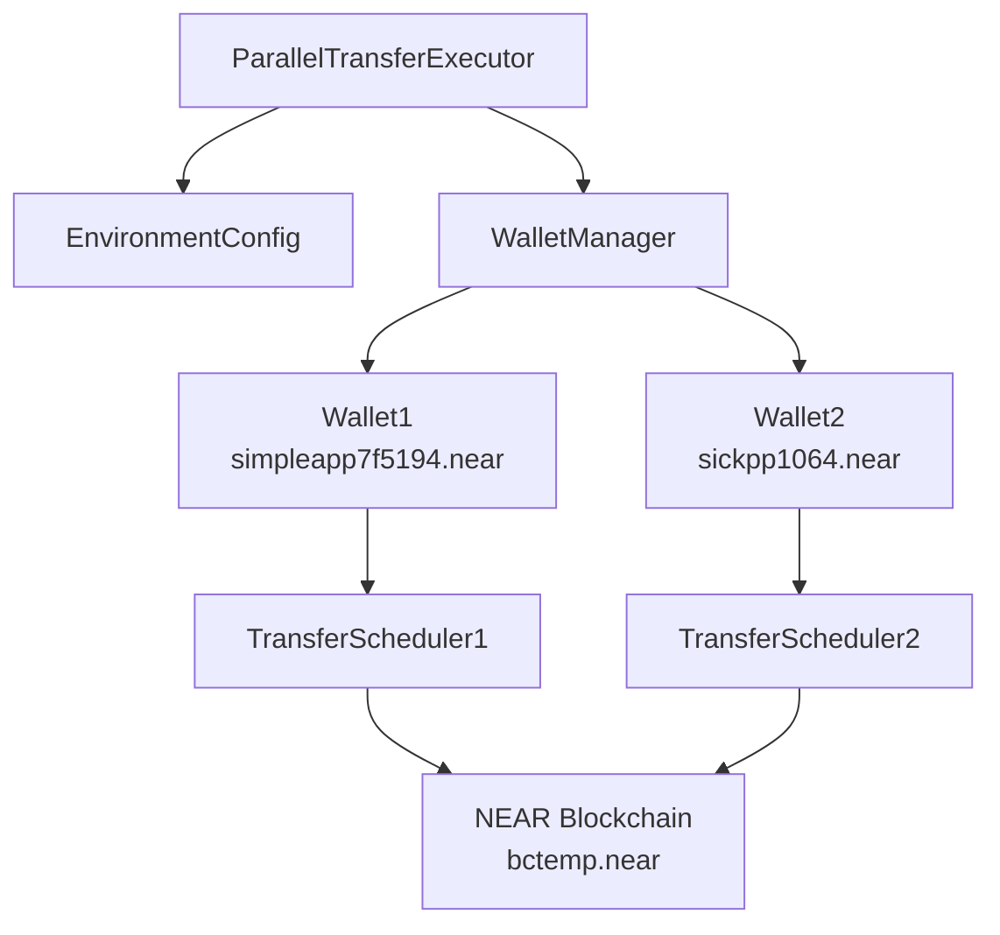

# Parallel Account Transfers Design Document

## 1. Overview

This document outlines the design for implementing parallel transfers from multiple accounts (`simpleapp7f5194.near` and `sickpp1064.near`) to a target account `bctemp.near` with a rate of 1 transaction per second from each account simultaneously.

Each account will use its own unique ID and private key for authentication. The transfers will be executed concurrently from both wallets at the same time, maintaining the 1-second interval between transactions within each account.

The implementation will be based on the existing parallel wallet transfer executor with modifications to:
1. Support dynamic wallet configuration from environment variables
2. Implement precise 1-second intervals between transactions
3. Ensure simultaneous execution from all configured accounts

## 2. Requirements

### 2.1 Functional Requirements
- Execute transfers from multiple accounts in parallel
- Maintain exactly 1 transaction per second rate from each account
- Support dynamic configuration of source accounts via environment variables
- Send transfers to the fixed target account `bctemp.near`
- Log transaction details and results

### 2.2 Non-Functional Requirements
- Secure handling of private keys through environment variables
- Error handling for failed transactions
- Graceful shutdown on interruption signals
- Detailed logging of execution progress

## 3. Architecture

### 3.1 Component Diagram

### 3.2 Data Flow
1. Load wallet configurations from environment variables
2. Initialize connections to all configured accounts
3. Schedule transfers with 1-second intervals for each account
4. Execute transfers in parallel across all accounts
5. Collect and report results

## 4. Environment Configuration

### 4.1 Required Environment Variables
The system will read account configurations from `.env.local`:

Environment variables will be used to configure the NEAR network settings, wallet credentials, and transfer parameters. Each source account will have its own unique account ID and private key stored as separate environment variables.

### 4.2 Configuration Schema
| Variable | Required | Description | Default |
|----------|----------|-------------|---------|
| `NEAR_NETWORK_ID` | Yes | NEAR network ID (mainnet/testnet) | mainnet |
| `NEAR_NODE_URL` | Yes | RPC endpoint URL | https://free.rpc.fastnear.com |
| `NEAR_ACCOUNT_ID_1` | Yes | Account ID for first account | simpleapp7f5194.near |
| `NEAR_PRIVATE_KEY_1` | Yes | Private key for first account | - |
| `NEAR_ACCOUNT_ID_2` | Yes | Account ID for second account | sickpp1064.near |
| `NEAR_PRIVATE_KEY_2` | Yes | Private key for second account | - |
| `TARGET_ACCOUNT_ID` | Yes | Target account for transfers | bctemp.near |
| `TRANSFER_AMOUNT_NEAR` | No | Amount to transfer in NEAR | 0.001 |
| `TRANSFERS_PER_ACCOUNT` | No | Number of transfers per account | 100 |
| `TRANSFER_INTERVAL_MS` | No | Interval between transfers in milliseconds | 1000 |

## 5. Implementation Details

### 5.1 Core Classes

#### 5.1.1 ParallelTransferExecutor
Main class responsible for orchestrating parallel transfers:

The `ParallelTransferExecutor` class orchestrates the parallel transfer execution process. It manages wallet configurations, initializes account connections, and coordinates the transfer sequences.

#### 5.1.2 Data Structures

The `WalletConfig` interface defines the structure for wallet configuration containing the account identifier and its associated private key.

The `TransferResult` interface represents the outcome of a transfer operation, including success status, transaction identifier, and any error information.

### 5.2 Execution Flow

#### 5.2.1 Initialization
1. Load environment variables
2. Parse wallet configurations
3. Validate required configurations
4. Initialize connections to all accounts

#### 5.2.2 Transfer Execution
1. Start transfer sequences for all accounts in parallel
2. For each account:
   - Execute transfers sequentially with 1-second intervals
   - Record results for each transfer
3. Wait for all sequences to complete
4. Generate execution summary

#### 5.2.3 Error Handling
- Failed transfers will be logged but execution will continue
- Account initialization failures will exclude that account from execution
- Network errors will be retried with exponential backoff

## 6. API Specification

### 6.1 Environment Variables API
| Variable | Type | Description |
|----------|------|-------------|
| `NEAR_NETWORK_ID` | string | Network identifier |
| `NEAR_NODE_URL` | string | RPC endpoint URL |
| `NEAR_ACCOUNT_ID_*` | string | Account IDs for source accounts |
| `NEAR_PRIVATE_KEY_*` | string | Private keys for source accounts |
| `TARGET_ACCOUNT_ID` | string | Destination account |
| `TRANSFER_AMOUNT_NEAR` | number | Transfer amount in NEAR |
| `TRANSFERS_PER_ACCOUNT` | number | Number of transfers per account |
| `TRANSFER_INTERVAL_MS` | number | Delay between transfers in milliseconds |

### 6.2 Transfer Result Schema
Transfer results will be structured with wallet identification, success status, optional transaction hash, and error details when applicable.

## 7. Security Considerations

### 7.1 Private Key Management
- Private keys must be stored only in `.env.local` which is git-ignored
- Keys should never be hardcoded in source files
- Environment variables should be properly secured on the execution environment

### 7.2 Transaction Validation
- Validate account balances before initiating transfers
- Implement rate limiting to prevent network spam
- Log all transactions for audit purposes

## 8. Performance Considerations

### 8.1 Rate Limiting
- 1 transaction per second per account to comply with network limits
- Parallel execution across accounts to maximize throughput
- Exponential backoff for failed transactions

### 8.2 Resource Management
- Connection pooling for RPC endpoints
- Memory-efficient result collection
- Graceful handling of long-running processes

## 9. Testing Strategy

### 9.1 Unit Tests
- Environment variable parsing and validation
- Transfer scheduling accuracy
- Error handling scenarios

### 9.2 Integration Tests
- Account initialization with valid/invalid keys
- Transfer execution with sufficient/insufficient funds
- Parallel execution synchronization

### 9.3 Performance Tests
- Verify 1-second interval accuracy
- Test with multiple accounts
- Validate resource consumption

## 10. Deployment

### 10.1 Execution
The system will be executed as a standalone TypeScript script using the Node.js runtime environment.

### 10.2 Prerequisites
- Node.js 16+
- TypeScript execution environment
- Valid NEAR account credentials
- Sufficient account balances

### 10.3 Monitoring
- Console output for real-time progress
- Summary report at completion
- Error logs for failed transactions
