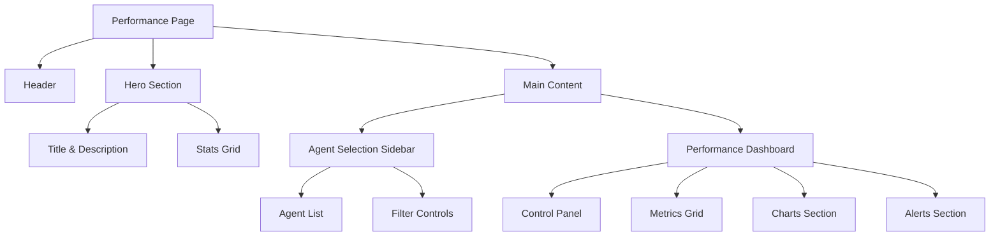
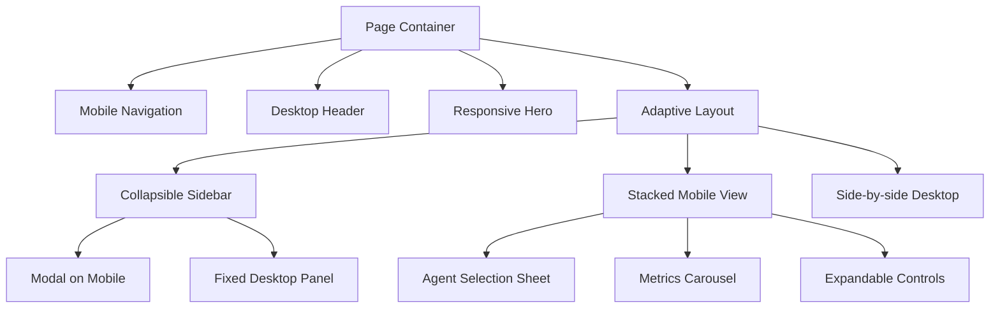
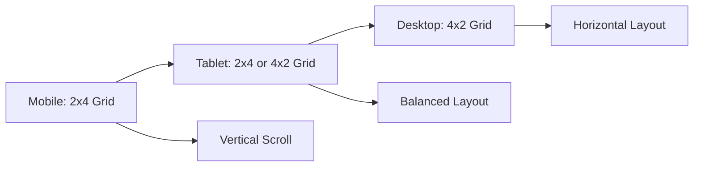
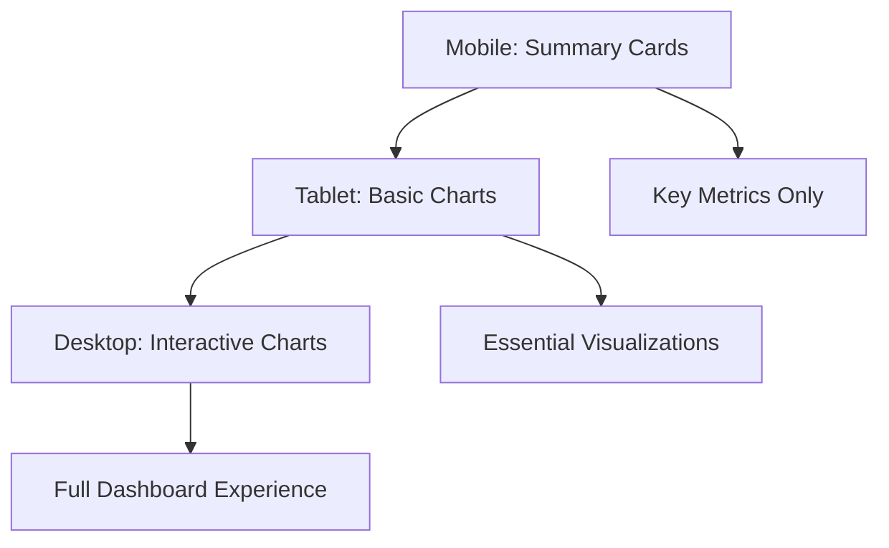

# Performance Page Responsive Design

## Overview

This design document outlines the transformation of the Risk Monitor Engine's performance page into a fully responsive interface optimized for all device sizes. The current performance page provides comprehensive agent monitoring capabilities but requires enhanced mobile responsiveness to ensure optimal user experience across smartphones, tablets, and desktop devices.

## Technology Stack & Dependencies

### Frontend Framework
- **Next.js 15** - React framework with server-side rendering
- **React 19.1.0** - UI component library
- **TypeScript** - Type safety and developer experience

### Styling Framework
- **Tailwind CSS** - Utility-first CSS framework with mobile-first approach
- **CSS Custom Properties** - Theme variables and dynamic styling
- **Backdrop filters** - Glass morphism effects

### Responsive Design System
- **Breakpoints**: Mobile-first approach with `sm` (640px), `md` (768px), `lg` (1024px), `xl` (1280px)
- **Grid System**: CSS Grid and Flexbox for complex layouts
- **Container Queries**: Responsive component sizing

## Component Architecture

### Current Performance Page Structure



### Responsive Component Hierarchy



## Responsive Layout Strategy

### Mobile-First Approach (320px - 767px)

#### Layout Transformations
- **Single Column Layout**: Convert 12-column grid to stacked vertical layout
- **Collapsible Sidebar**: Transform fixed sidebar into bottom sheet modal
- **Touch-Friendly Controls**: Increase button sizes and touch targets
- **Simplified Navigation**: Condensed header with hamburger menu

#### Mobile Layout Structure
```
┌─────────────────────┐
│      Header         │ ← Sticky header with hamburger menu
├─────────────────────┤
│   Hero Section      │ ← Condensed title and key stats
├─────────────────────┤
│   Agent Selector    │ ← Bottom sheet or modal trigger
├─────────────────────┤
│   Performance       │ ← Stacked metrics cards
│     Metrics         │
├─────────────────────┤
│   Charts Area       │ ← Horizontally scrollable
├─────────────────────┤
│   Alerts Section    │ ← Collapsed by default
└─────────────────────┘
```

### Tablet Layout (768px - 1023px)

#### Layout Adaptations
- **Two-Column Layout**: Sidebar and main content side by side
- **Responsive Grid**: 2x4 metrics grid instead of 4x2
- **Adaptive Typography**: Scaled font sizes for tablet viewing
- **Touch Optimization**: Medium-sized touch targets

### Desktop Layout (1024px+)

#### Layout Features
- **Three-Column Layout**: Full sidebar, main content, and optional details panel
- **Advanced Grid Systems**: 4-column metrics display
- **Hover Interactions**: Enhanced desktop-specific interactions
- **Keyboard Navigation**: Full keyboard accessibility

## Detailed Responsive Design Specifications

### Hero Section Responsiveness

#### Mobile (sm: 640px and below)
```css
/* Typography Scaling */
h1: text-4xl → text-3xl
subtitle: text-xl → text-lg
padding: py-20 → py-12

/* Stats Grid */
grid-cols-4 → grid-cols-2
gap-6 → gap-4
p-8 → p-4
```

#### Tablet (md: 768px - lg: 1024px)
```css
/* Balanced Layout */
h1: text-5xl
subtitle: text-xl
stats: grid-cols-2 lg:grid-cols-4
```

#### Desktop (lg: 1024px+)
```css
/* Full Layout */
h1: text-6xl lg:text-7xl
subtitle: text-2xl
stats: grid-cols-4
```

### Agent Selection Panel

#### Mobile Implementation
- Convert fixed sidebar to slide-up bottom sheet
- Trigger button in header: "Select Agent"
- Full-screen overlay with agent list
- Swipe-to-dismiss functionality

#### Tablet Implementation
- Collapsible left sidebar (300px width)
- Toggle button in header
- Overlay on content when expanded

#### Desktop Implementation
- Fixed left sidebar (320px width)
- Always visible with scroll
- Hover states and animations

### Performance Metrics Grid

#### Responsive Grid Patterns



#### Grid Breakpoints
```css
/* Mobile: Stack in 2 columns */
.metrics-grid {
  @apply grid grid-cols-2 gap-3 sm:gap-4;
}

/* Tablet: 2x4 or adapt to space */
@screen md {
  .metrics-grid {
    @apply grid-cols-2 md:grid-cols-4 gap-4 md:gap-6;
  }
}

/* Desktop: Full 4-column layout */
@screen lg {
  .metrics-grid {
    @apply grid-cols-4 gap-6;
  }
}
```

### Control Panel Responsiveness

#### Mobile Layout
- Stack all controls vertically
- Full-width dropdowns and toggles
- Collapsible sections for less important controls

#### Tablet/Desktop Layout
- Horizontal layout with grouped controls
- Inline selectors and toggles
- Persistent visibility of all controls

## Mobile Navigation & Interaction Patterns

### Touch-First Design Principles

#### Touch Target Specifications
- **Minimum Size**: 44px × 44px for all interactive elements
- **Spacing**: 8px minimum between touch targets
- **Feedback**: Visual and haptic feedback for all interactions

#### Gesture Support
- **Swipe Navigation**: Between agent selections
- **Pull-to-Refresh**: Update performance data
- **Pinch-to-Zoom**: Chart interactions
- **Long Press**: Context menus and additional options

### Mobile-Specific Features

#### Bottom Sheet Agent Selector
```typescript
interface AgentSelectorSheet {
  trigger: "Select Agent" button
  animation: slide-up transition
  backdrop: semi-transparent overlay
  dismissal: swipe-down | tap-outside | close-button
  search: sticky search bar at top
  list: scrollable agent list with large touch targets
}
```

#### Responsive Alert System
- **Mobile**: Compact alert banners with tap-to-expand
- **Tablet/Desktop**: Full alert cards with inline actions

## Layout Component Adaptations

### Main Container Layout

```typescript
// Responsive layout structure
const PerformanceLayout = {
  mobile: {
    layout: "flex flex-col min-h-screen",
    sidebar: "hidden", // Converted to modal
    main: "flex-1 p-4"
  },
  tablet: {
    layout: "flex min-h-screen",
    sidebar: "w-80 border-r", // Collapsible
    main: "flex-1 p-6"
  },
  desktop: {
    layout: "grid grid-cols-12 min-h-screen",
    sidebar: "col-span-4", // Fixed position
    main: "col-span-8 p-8"
  }
}
```

### Agent Card Responsive Design

```css
/* Mobile: Full width cards */
.agent-card-mobile {
  @apply w-full p-4 mb-3 rounded-lg;
}

/* Tablet: Two-column layout */
.agent-card-tablet {
  @apply md:w-[calc(50%-0.5rem)] p-5 mb-4 rounded-xl;
}

/* Desktop: Enhanced layout with hover states */
.agent-card-desktop {
  @apply lg:w-full p-6 mb-6 rounded-2xl hover:scale-[1.02] transition-transform;
}
```

## Performance Metrics Display

### Responsive Metrics Cards

#### Mobile Optimization
- **Card Size**: Reduced padding and font sizes
- **Information Hierarchy**: Primary metric prominent, secondary details collapsible
- **Stacking**: Vertical arrangement for better mobile readability

#### Tablet Optimization
- **Balanced Layout**: 2x4 grid for optimal space usage
- **Enhanced Typography**: Medium font sizes for tablet viewing distance
- **Interactive Elements**: Touch-optimized buttons and controls

#### Desktop Enhancement
- **Rich Layouts**: Full 4-column grid with additional detail
- **Hover States**: Interactive previews and expanded information
- **Advanced Controls**: Inline editing and configuration options

### Charts & Data Visualization

#### Mobile Charts Strategy
- **Simplified Views**: Essential metrics only
- **Horizontal Scroll**: For time-series data
- **Touch Interactions**: Tap for details, swipe for navigation
- **Alternative Formats**: Summary cards instead of complex charts

#### Progressive Enhancement


## Responsive State Management

### Viewport-Aware Component Behavior

```typescript
interface ResponsiveState {
  viewport: 'mobile' | 'tablet' | 'desktop'
  sidebarOpen: boolean
  selectedAgent: string | null
  mobileSheetOpen: boolean
  
  // Responsive adaptations
  gridColumns: 2 | 4
  cardSize: 'compact' | 'normal' | 'large'
  navigationMode: 'modal' | 'sidebar' | 'fixed'
}
```

### Breakpoint Detection

```typescript
const useResponsiveLayout = () => {
  const [viewport, setViewport] = useState<Viewport>('mobile')
  
  useEffect(() => {
    const updateViewport = () => {
      const width = window.innerWidth
      if (width < 768) setViewport('mobile')
      else if (width < 1024) setViewport('tablet')
      else setViewport('desktop')
    }
    
    updateViewport()
    window.addEventListener('resize', updateViewport)
    return () => window.removeEventListener('resize', updateViewport)
  }, [])
  
  return { viewport, isMobile: viewport === 'mobile' }
}
```

## Implementation Strategy

### Phase 1: Foundation (Mobile-First)
1. **Viewport Meta Setup**: Ensure proper mobile viewport configuration
2. **Base Layout**: Convert fixed layouts to flexible grid systems
3. **Typography Scale**: Implement responsive font sizing
4. **Touch Targets**: Enhance button and interactive element sizing

### Phase 2: Navigation & Layout
1. **Mobile Navigation**: Implement hamburger menu and mobile header
2. **Sidebar Conversion**: Transform sidebar to bottom sheet modal
3. **Grid Adaptation**: Implement responsive grid systems
4. **Container Queries**: Add responsive container sizing

### Phase 3: Component Enhancement
1. **Agent Selection**: Build responsive agent picker interface
2. **Metrics Cards**: Optimize performance metric displays
3. **Charts Adaptation**: Implement mobile-friendly data visualization
4. **Control Panel**: Create responsive control interfaces

### Phase 4: Interaction & Polish
1. **Touch Gestures**: Add swipe and touch interactions
2. **Animations**: Implement smooth transitions between states
3. **Performance**: Optimize for mobile performance
4. **Accessibility**: Ensure responsive accessibility compliance

## Testing Strategy

### Device Testing Matrix

| Device Category | Screen Sizes | Key Tests |
|----------------|--------------|-----------|
| Mobile Phones | 320px - 480px | Touch navigation, readability, performance |
| Large Phones | 480px - 640px | One-handed usage, content hierarchy |
| Tablets | 640px - 1024px | Split layouts, hybrid interactions |
| Desktop | 1024px+ | Full feature set, keyboard navigation |

### Responsive Testing Scenarios

#### Mobile Testing
- **Portrait/Landscape**: Layout adaptation to orientation changes
- **Touch Interactions**: All buttons and controls accessible by thumb
- **Performance**: Fast loading and smooth scrolling
- **Content Prioritization**: Most important information visible first

#### Cross-Device Consistency
- **Visual Hierarchy**: Consistent information hierarchy across devices
- **Feature Parity**: Core functionality available on all devices
- **Data Persistence**: State management across device switches

## Accessibility Considerations

### Responsive Accessibility Features

#### Mobile Accessibility
- **Large Touch Targets**: Minimum 44px touch areas
- **High Contrast**: Enhanced contrast for small screens
- **Voice Control**: Support for voice navigation commands
- **Screen Reader**: Optimized content order for mobile screen readers

#### Keyboard Navigation
- **Focus Management**: Logical tab order across responsive layouts
- **Skip Links**: Device-appropriate navigation shortcuts
- **Keyboard Shortcuts**: Responsive keyboard command sets

### WCAG Compliance

#### Responsive Compliance Requirements
- **AA Color Contrast**: Maintained across all screen sizes
- **Text Scaling**: Support for 200% zoom without horizontal scroll
- **Touch Target Size**: Meet minimum accessibility standards
- **Focus Indicators**: Visible focus states for all interactive elements